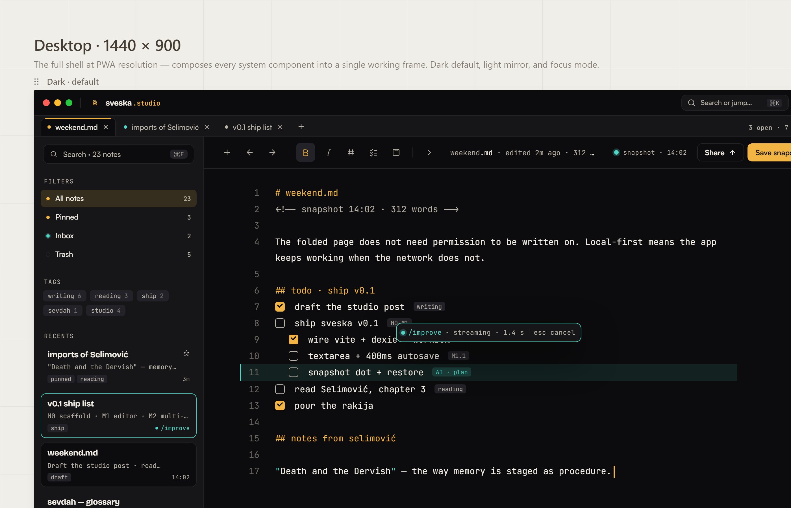
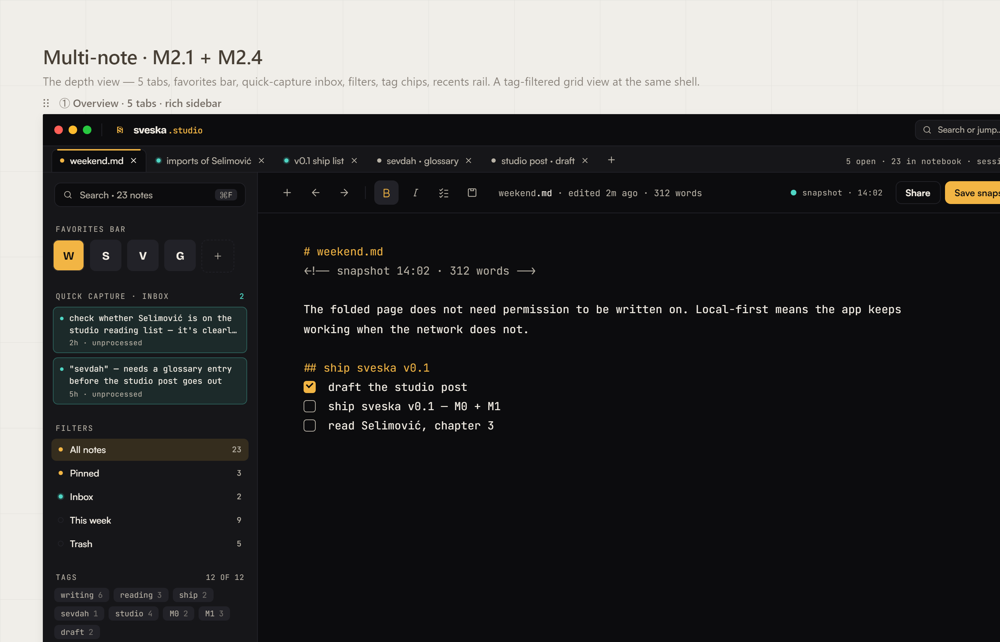
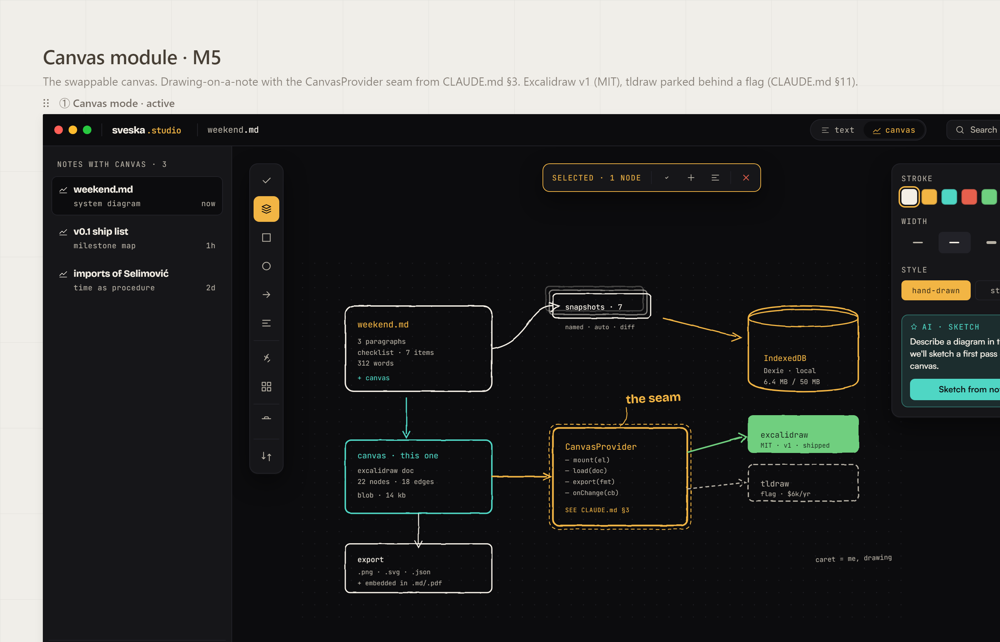
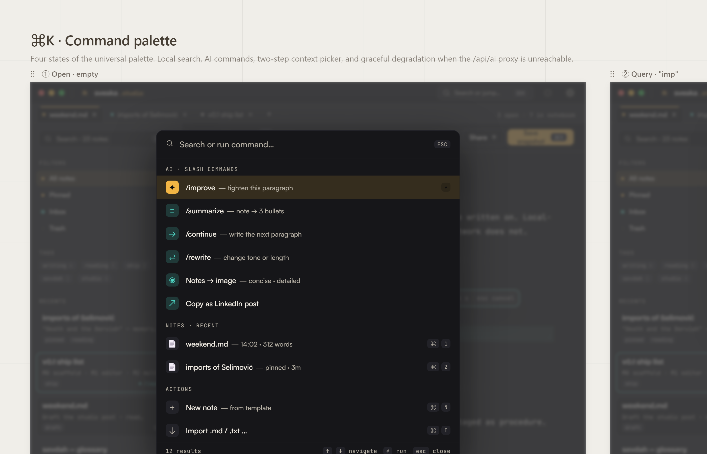
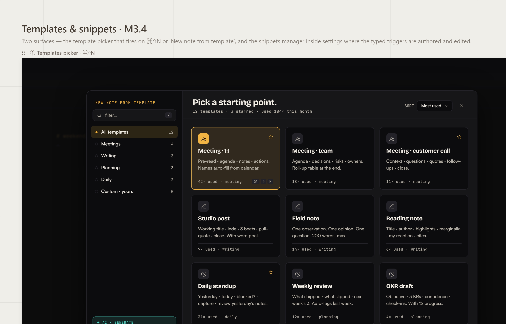
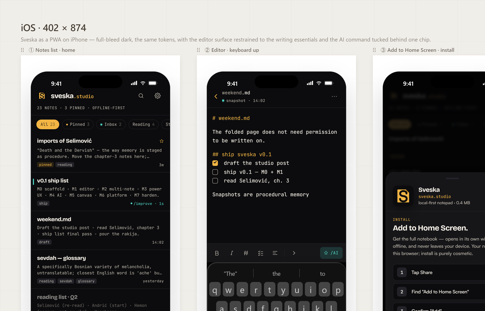
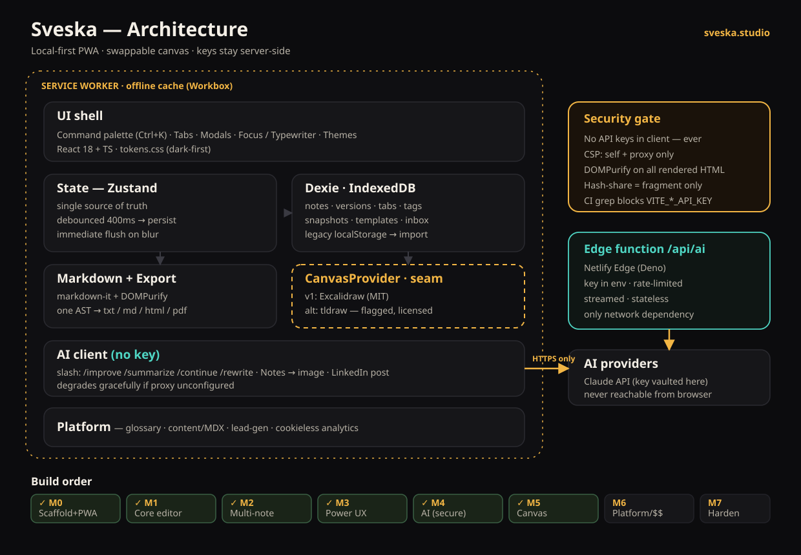

# Sveska

> **Sveska** /ˈsvɛska/ — _Bosnian: notebook, exercise book._
> A studio-grade, **local-first, offline-first** notepad PWA at [sveska.studio](https://sveska.studio).

<p align="center">
  <a href="https://sveska.studio">
    
  </a>
</p>

[](https://sveska.studio)
[](https://github.com/mizcausevic-dev/sveska/releases/tag/v0.7.0-m7)
[](#milestone-status)
[](LICENSE)

Multi-note tabs, Markdown + checklist modes, command palette, fuzzy search across notes,
streaming AI assistance, OG-card image export — all local. No account, no telemetry until
you opt in, no cloud dependency. The reference behaviour is `notepad.js.org` (Amit
Merchant, MIT). Sveska re-implements it as a typed, modular PWA with a platform surface
from day one.

## Screenshots

<table>
  <tr>
    <td width="50%"><a href="docs/screenshots/01-app-shell.png"></a><br><sub><strong>App shell</strong> — multi-note tabs, notes rail with All/Pinned/Inbox filters + tags + recents, editor mid-flow with the <code>/improve</code> streaming pill</sub></td>
    <td width="50%"><a href="docs/screenshots/02-multinote.png"></a><br><sub><strong>Multi-note · search · history</strong> — the tab chrome, fuzzy search modal, and version-history diff side by side</sub></td>
  </tr>
  <tr>
    <td><a href="docs/screenshots/03-canvas.png"></a><br><sub><strong>Canvas (Excalidraw)</strong> — per-note drawing surface behind the <code>CanvasProvider</code> seam, lazy-loaded</sub></td>
    <td><a href="docs/screenshots/04-ai-flows.png"></a><br><sub><strong>AI flows</strong> — <code>Ctrl+K</code> palette with the five slash commands, Notes→image, Copy as LinkedIn post</sub></td>
  </tr>
  <tr>
    <td><a href="docs/screenshots/05-templates-snippets.png"></a><br><sub><strong>Templates + snippets</strong> — 5 built-in starts (meeting, daily, retro, standup, brief) plus user templates and the trigger-typeahead snippet manager</sub></td>
    <td><a href="docs/screenshots/06-mobile-pwa.png"></a><br><sub><strong>Mobile PWA</strong> — installable, offline-capable, same editor surface adapted to phone widths</sub></td>
  </tr>
</table>

<sub>Source mockups in <a href="docs/design-mocks/"><code>docs/design-mocks/</code></a>; rendered to PNGs by <a href="scripts/capture-mocks.mjs"><code>scripts/capture-mocks.mjs</code></a> (Playwright + Chromium headless).</sub>

## Features (live as of M7)

| Layer       | What's shipped                                                                                                                |
| ----------- | ----------------------------------------------------------------------------------------------------------------------------- |
| Editor      | Native textarea · autosave (400 ms debounce + flush on blur/visibility) · crash-safe draft shadow                             |
| Modes       | TXT · MD (split preview, DOMPurify XSS gate) · CHK (click-toggle, drag-reorder, indent levels, hide done)                     |
| Navigation  | Multi-note tabs · session restore · NotesRail (pinned / recent / saved filters / tags)                                        |
| Discovery   | `Ctrl+K` command palette (fuzzy) · inline slash commands · `Ctrl+P` fuzzy search across all notes (<50 ms / 1k)               |
| Capture     | Inbox (`Ctrl+Shift+K`) · Web Share Target → inbox · import .txt / .md (file picker + drag-drop)                               |
| Snapshots   | Per-note version history with side-by-side LCS diff + Restore                                                                 |
| Writing     | Typewriter mode · WebAudio typing clicks · paper textures · writing-session timer · word goal · `Ctrl+F` find                 |
| Templates   | 5 built-in note templates · user templates · snippet typeahead (`;date`, `;todo`, `;hr`)                                      |
| Export      | `.txt` / `.md` / `.html` (prose for md) · share-via-URL hash · `.pdf` (lazy jsPDF)                                            |
| AI          | Streaming Anthropic proxy on Cloudflare Pages Functions · `/improve` `/summarize` `/continue` `/rewrite` · LinkedIn-post copy |
| AI visual   | Notes → image (Concise / Detailed) rendered on 1200×630 canvas, downloads as PNG                                              |
| Canvas      | Per-note Excalidraw canvas (lazy-loaded, 2.6 MB only on first open) · PNG export · dark-themed                                |
| Platform    | `/glossary` (20-term auto-linker) · `/blog` + `/changelog` (Markdown content) · `/pricing` · `/funnel` dashboard              |
| Lead-gen    | Email capture · CTA slots · MDX export with frontmatter · HTML-export footer back-links                                       |
| A11y        | Keyboard-first, focus rings, `prefers-reduced-motion` honored, axe-clean App / Glossary / Pricing                             |
| Hardening   | Top-level `ErrorBoundary` (Reload / Copy report / Reset) · on-demand Playwright smoke suite (`pnpm test:e2e`)                 |
| Persistence | Dexie (IndexedDB) — 8 tables, soft-delete, legacy-localStorage import on first run                                            |

## Stack (locked at M0)

| Concern     | Choice                                                                                                                  |
| ----------- | ----------------------------------------------------------------------------------------------------------------------- |
| Build       | Vite + React 18 + TypeScript (strict, `noUncheckedIndexedAccess`, `exactOptionalPropertyTypes`)                         |
| State       | Zustand                                                                                                                 |
| Storage     | Dexie (IndexedDB)                                                                                                       |
| Markdown    | `markdown-it` + DOMPurify                                                                                               |
| PWA         | `vite-plugin-pwa` (Workbox, `registerType: 'autoUpdate'`)                                                               |
| Router      | `react-router-dom` v6                                                                                                   |
| Tests       | Vitest + Testing Library + `fake-indexeddb` (260 tests, 100% pass) · `vitest-axe` a11y sweep · on-demand Playwright e2e |
| Lint/format | ESLint 9 (flat config, typed) + Prettier 3                                                                              |
| Pre-commit  | Husky 9 + lint-staged                                                                                                   |
| Edge        | **Cloudflare Pages Functions** (Workers runtime) — same-origin AI proxy at `/api/ai`                                    |
| Canvas (M5) | Excalidraw (MIT), vendored, lazy-loaded behind `CanvasProvider`                                                         |

## Getting started

```bash
pnpm install
pnpm dev            # http://localhost:5173
pnpm build          # builds, generates sitemap, runs key-leak + bundle-budget gates
pnpm preview        # serves the built bundle
pnpm test           # Vitest + Testing Library (260 tests, ~10s)
pnpm test:e2e       # on-demand: builds dist/, runs Playwright smoke suite (offline + 3 routes + manifest)
pnpm typecheck
pnpm lint
```

Requires Node ≥ 20 and pnpm 10. Husky installs a pre-commit hook on `pnpm install` that
runs `lint-staged` (Prettier on touched files) plus `pnpm typecheck`.

### Optional: enable AI

The AI proxy ships disabled. Set the secret once on Cloudflare Pages:

```bash
wrangler pages secret put ANTHROPIC_API_KEY --project-name=sveska
```

Or via the dashboard: **CF Pages → sveska → Settings → Environment variables →
Production → Add** · type **Secret**.

Without the secret, `/api/ai` returns 503 and the in-app AI flows degrade to a friendly
"AI offline" toast instead of crashing. Everything else works unchanged.

## Security gate

CLAUDE.md §5. Hard, enforced now (not deferred):

1. **No API keys in the client.** `scripts/check-no-keys.mjs` runs at the end of every build
   and fails on any `VITE_*_API_KEY` / `ANTHROPIC_API_KEY` / `sk-…` / bearer-shaped string.
2. **CSP `default-src 'self'`.** Declared as both an HTML meta tag (runtime) and a
   `public/_headers` rule shipped to Cloudflare Pages (defence-in-depth). The AI proxy
   lives at `/api/ai` (same origin), so no `connect-src` expansion is needed.
3. **No third-party trackers** in the app shell. Analytics is a seam with a no-op default and
   a consent gate (`ConsentBar`). Real vendor is decided at M6 and must be cookieless.
4. **Self-hosted fonts.** Bricolage Grotesque 700 + JetBrains Mono 600 ship as TTFs in
   `public/brand/fonts/`; Satoshi and Newsreader fall back to `system-ui` / Georgia until
   vendored.

## Bundle budget

`scripts/check-bundle.mjs` parses `dist/index.html` and only counts assets it directly
references, so `import()` chunks (jsPDF, html2canvas) don't count against the budget.

| Surface              | Gzip      | Loaded                                         |
| -------------------- | --------- | ---------------------------------------------- |
| Initial JS           | 178.47 KB | every page load (editor + Home only)           |
| Initial CSS          | 8.09 KB   | every page load                                |
| Lazy platform routes | ~25 KB    | per route — glossary / blog / pricing / funnel |
| Lazy `.pdf` chunk    | ~223 KB   | first `.pdf` export click only                 |
| Lazy canvas chunk    | ~2.6 MB   | first canvas open (Excalidraw + deps)          |
| **Budget**           | 180 KB    | initial JS — under by 1.53 KB                  |

## Milestone status

|        | Ticket set                                                                                              | Status                                                                           |
| ------ | ------------------------------------------------------------------------------------------------------- | -------------------------------------------------------------------------------- |
| **M0** | Scaffold + platform skeleton                                                                            | ✅ [v0.0.1-m0](https://github.com/mizcausevic-dev/sveska/releases/tag/v0.0.1-m0) |
| **M1** | Core editor (notepad.js.org parity)                                                                     | ✅ [v0.1.0-m1](https://github.com/mizcausevic-dev/sveska/releases/tag/v0.1.0-m1) |
| **M2** | Multi-note tabs · version history · tags/pins · fuzzy search · inbox                                    | ✅ [v0.2.0-m2](https://github.com/mizcausevic-dev/sveska/releases/tag/v0.2.0-m2) |
| **M3** | Command palette · MD/checklist modes · templates · typewriter · paper · find/replace · import/share/PDF | ✅ [v0.3.0-m3](https://github.com/mizcausevic-dev/sveska/releases/tag/v0.3.0-m3) |
| **M4** | AI proxy (Cloudflare Pages Function, ported from Netlify at M7+) · slash AI commands · Notes → image    | ✅ [v0.4.0-m4](https://github.com/mizcausevic-dev/sveska/releases/tag/v0.4.0-m4) |
| **M5** | Canvas (Excalidraw, vendored + lazy + behind seam)                                                      | ✅ [v0.5.0-m5](https://github.com/mizcausevic-dev/sveska/releases/tag/v0.5.0-m5) |
| **M6** | Platform & monetisation (glossary engine, blog, lead-gen, pricing)                                      | ✅ [v0.6.0-m6](https://github.com/mizcausevic-dev/sveska/releases/tag/v0.6.0-m6) |
| **M7** | Hardening (Playwright offline, perf CI, a11y, security review, ErrorBoundary)                           | ✅ [v0.7.0-m7](https://github.com/mizcausevic-dev/sveska/releases/tag/v0.7.0-m7) |

## Architecture

<p align="center">
  
</p>

## Repo map

```
sveska/
  index.html
  /public                  manifest, /brand (icons, fonts, logos), robots, sitemap
  /scripts                 check-no-keys · check-bundle · generate-sitemap
  /functions/api          /ai.ts — Anthropic streaming proxy (Cloudflare Pages Function, Workers runtime)
  /public/_headers        security headers (CSP + frame-ancestors + permissions-policy)
  /public/_redirects      SPA fallback + canonical www → apex
  /wrangler.toml          CF Pages build config
  /src
    /app         router, layout, KeyBindings, UpdateBanner
    /editor      Editor + TabBar + TagsBar + SnapshotToolbar + VersionsModal +
                 ChecklistPane + PreviewPane + SlashCommands + FindReplace +
                 NotesRail + DraftRecoveryBanner + writingTimerStore +
                 ExportMenu + StatsModal + ClearConfirm
    /notes       Dexie schema (8 tables) · noteRepo · tabsStore · snapshotRepo ·
                 draftRepo · prefs · editorPrefs · themeStore · inboxRepo ·
                 templatesRepo · snippetsRepo · uiStore · notesRailStore
    /markdown    markdown-it + DOMPurify renderer · ast · export
    /canvas      CanvasProvider seam (Excalidraw vendored at M5)
    /ai          aiClient (SSE consumer) · aiRunStore · AIResultPane · AIToast ·
                 prompts · imageSpec · renderImage
    /platform    glossary · ConsentBar · useSeo
    /ui          Modal · PrefsModal · ShortcutsModal · SearchModal · InboxModal ·
                 CommandPalette · TemplatesModal · ThemeSwitch · commandCatalog
    /lib         debounce · fuzzy (1k-notes <50ms) · diff (LCS) · checklist ·
                 hashShare · importFiles · exportPdf (lazy)
    /routes      Home · Glossary · ShareTarget · NotFound
    /styles      tokens.css · fonts.css · global.css
  /docs                    architecture.svg · design-mocks/ · landing/
  /server                  reserved for any future non-edge backend (not currently used)
```

## Doc map

| Doc                                                | Purpose                                              |
| -------------------------------------------------- | ---------------------------------------------------- |
| [CLAUDE.md](CLAUDE.md)                             | Full spec, milestones, ticket-level acceptance       |
| [tasks.md](tasks.md)                               | Live TODO + completed work log                       |
| [memory.md](memory.md)                             | Locked decisions, gotchas, perf snapshot per ticket  |
| [docs/threat-model.md](docs/threat-model.md)       | What we defend, what we accept                       |
| [docs/security-review.md](docs/security-review.md) | M7 walkthrough of CLAUDE.md §5 — controls + evidence |
| [docs/roi.md](docs/roi.md)                         | Path-to-$15K MRR math + funnel + acquisition lanes   |
| [src/ai/README.md](src/ai/README.md)               | AI threat model + secret-setup command               |

## License

MIT — see [LICENSE](LICENSE). Brand kit is © Kinetic Gain; use within the app is granted by
the repo licence, redistribution of brand assets outside Sveska is not.
